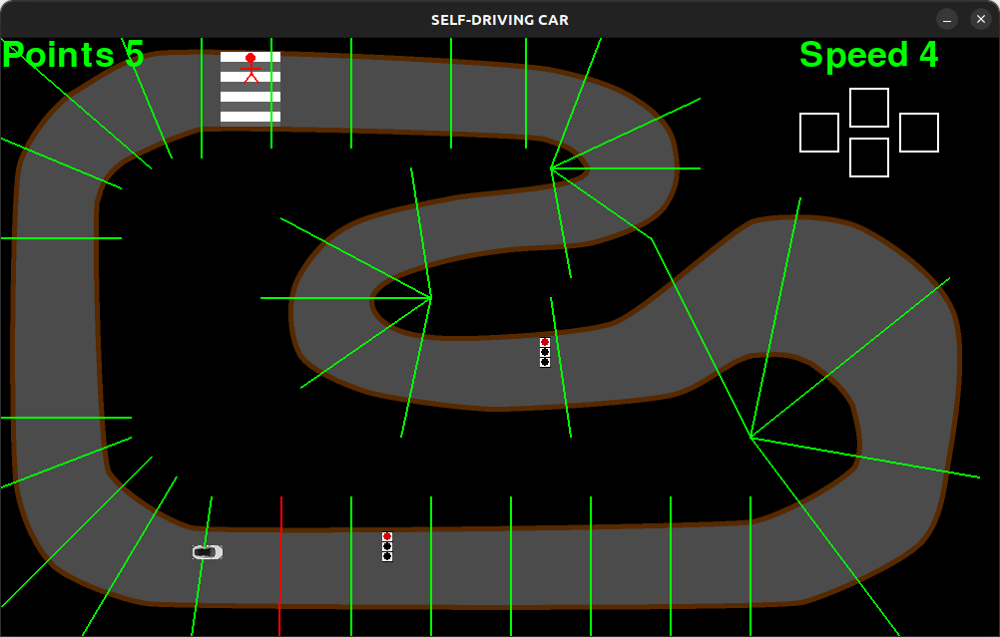

# Reinforcement-Learning : Projet final
Ce projet, effectué dans le cadre du cours de Reinforcement Learning, vise à mettre en oeuvre l'algorithme de **Q-Learning** pour construire une voiture autonome. 

## Installation
Pour lancer l'application, cloner le dépôt git dans un dossier de son choix en utilisant la commande suivante : 
```bash
git clone https://github.com/tommy-21/RL-final-project.git
```
Suivre maintenant les étapes suivantes pour : 
-  se mettre dans le dossier `RL-final-project`;
-  créer un environnement virtuel ;
-  activer l'environnement virtuel ;
-  installer les librairies nécessaires au bon fonctionnement de l'application ;
-  lancer l'application et suivre les étapes dans la fenêtre qui s'affiche.

Tout le code nécessaire pour réaliser ces étapes se trouve dans le bloc suivant : 

```bash
cd RL-final-project
python -m venv venv
source venv/bin/activate
pip install requirements.txt
python main.py
```

## Utilisation

L'utilisateur du jeu de voiture automatique a le choix entre trois modes de jeu : 
- le **mode automatique** 
- le **mode semi-automatique**
- le **mode manuel**.

### Mode automatique 
Dans ce mode, la voiture se déplace de manière automatique sans avoir besoin de l'utilisateur. Les actions (décisions) de la voiture sont prédites par le modèle **DDQN** implémenté derrière. Le jeu s'arrête lorsque la voiture rencontre un obstacle.

### Mode semi-automatique
Ce mode est actuellement en cours d'implémentation. Pour l'instant, ce mode est semblable à celui automatique. 

### Mode manuel
Dans ce mode, la voiture est guidée par l'utilisateur qui utilise les touches directionnelles.  

## Structure du Projet 
La structure du code d'implémentation se présente comme suit : 


Le dossier `gameEnv` contient tout le code qui implémente l'application **pygame**. L'environnement de jeu est composé de : 
- la voiture (`Car.py`) représenté par un rectangle ;
- la voie principale bordée par des murs (`Walls.py`) ;
- les buts (`Goals.py`) qui sont représentes par des lignes. Ces lignes permettent à la voiture de maintenir un objectif précis en avançant sur la route ;
- les obstacles (`Obstacles.py`) qui représentent en gros les feux tricolores, le passage piéton et un piéton ;
- la voiture est équipée de radars (`Rays.py`)  qui calculent la distance entre la voiture et les murs les plus proches ainsi que les différents obstacles ;
- la fenêtre de jeu (`GameEnv.py`) qui utilise tous ces composants pour constituer l'environnement du jeu.

Le dossier `model` contient l'architecture du réseau de neurones (modèle **Double Deep Q-Learning Network (DDQN)**) utilisé pour choisir les actions de la voiture autonome.

Le dossier `images` contient les images de la voiture et de la route. 

Le dossier `utils` contient d'autres fonctions utiles au bon fonctionnement du code.

## Apprentissage
La phase d'apprentissage a consisté d'une part à générer des données d'apprentissage à parties de plusieurs parties du jeu (simulations) puis à utiliser ces données pour faire tourner l'algorithme d'aprentissage qu'est le **Q-Learning**. Cette dernière partie a nécessité l'utilisation d'un modèle de réseaux de neurones qui aura pour rôle de modéliser la fonction qui associe à chaque couple état-action, une valeur donnée (la q-valeur).  

### Simulation
Pour obtenir les données d'apprentisage, plusieurs parties du jeu (épisodes) sont lancées les unes à la suite des autres. Chaque partie se termine lorsque la voiture cogne un obstacles. Les données récoltés sont les valeurs des variables d'état à un moment donné, l'action effectuée, les nouvelles valeurs des variables d'état suite à l'action effectuée. Les actions effectuées durant l'apprentissage sont déterminées soit au hasard, soit en utilisant le modèle encore en apprentissage. Le choix est déterminé par un facteur epsilon ($\epsilon$-greedy). La récompense correspondante à chaque état est aussi une valeur importante dans le processus d'apprentissage et est déduite à partir des valeurs des variables d'état.
Les états sont définis grâce à la méthode du ray tracing. Cette méthode consiste à faire partir de la voiture plusieurs rayons. Ils permettent notamment de déterminer la distance entre la voiture et les différents murs présents. La méthode permet également de connaître pour chaque rayon le point du mur qui est atteint. 
Les états correspondent alors aux distances par rapport aux murs les plus proches. Les rayons servent à évaluer la proximité du mur. Par ailleurs, un autre état pris en compte est le rapport entre la vitesse actuelle de la voiture et la vitesse maximale. 

Les actions sont associées au fait d'accélérer ou de ralentir, de tourner à gauche ou à droite. 

Les récompenses sont associées au fait d'atteindre le but. Si la voiture atteint la destination, le gain est de 10. Si la voiture entre en collision avec un mur, la pénalité est de -10. 
Si la voiture s'éloigne du but à atteindre d'une itération à une autre, la récompense est de -1. Cela est calculé à l'aide de la méthode compute_distances de la classe Car. 

### Modélisation
Ici, nous allons décrire le fonctionnement global du modèle DDQN expliqué [ici](https://towardsdatascience.com/double-deep-q-networks-905dd8325412).
Le modèle DDQN est composé de deux réseaux de neurones : un réseau **target** et un réseau **eval**. Le réseau **eval** est celui utilisé pour prédire les différentes actions à prendre et le réseau target permet de stabiliser l'apprentissage en fournissant des estimations de Q-valeurs plus stables. Il est périodiquement mis à jour à partir du réseau eval pour suivre ses évolutions.
Les deux réseaux de neurones sont constituées de trois couches denses qui permettent de prédire les q-valeurs pour chaque couple action-état. Nous avons utilisé l



## Contributeurs 
Les membres du groupe sont les suivants : 
- [Nathan GORSE](https://github.com/Nathangos)
- [Julien SAWADOGO](https://github.com/SAWAjulco)
- [Cyrille NEBANGA](https://github.com/odi77)
- [Tom AGONNOUDE](https://github.com/tommy)
- [Horeb SEIDOU](https://github.com/Horeb136)


