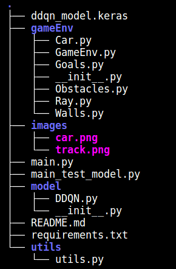

# Reinforcement-Learning : Projet final
Ce projet, effectué dans le cadre du cours de Reinforcement Learning, vise à mettre en oeuvre l'algorithme de **Q-Learning** pour construire une voiture autonome. 

## Installation
Pour lancer l'application, cloner le dépôt git dans un dossier de son choix en utilisant la commande suivante : 
```bash
git clone https://github.com/tommy-21/RL-final-project.git
```
Suivre maintenant les étapes suivantes pour : 
-  se mettre dans le dossier `RL-final-project`;
-  créer un environnement virtuel ;
-  activer l'environnement virtuel ;
-  installer les librairies nécessaires au bon fonctionnement de l'application ;
-  lancer l'application et suivre les étapes dans la fenêtre qui s'affiche.

Tout le code nécessaire pour réaliser ces étapes se trouve dans le bloc suivant : 

```bash
cd RL-final-project
python -m venv venv
source venv/bin/activate
pip install requirements.txt
python main.py
```

## Utilisation

L'utilisateur du jeu de voiture automatique a le choix entre trois modes de jeu : 
- le **mode automatique** 
- le **mode semi-automatique**
- le **mode manuel**.

### Mode automatique 
Dans ce mode, la voiture se déplace de manière automatique sans avoir besoin de l'utilisateur. Les actions (décisions) de la voiture sont prédites par le modèle **DDQN** implémenté derrière. Le jeu s'arrête lorsque la voiture rencontre un obstacle.

### Mode semi-automatique
Ce mode est actuellement en cours d'implémentation. Pour l'instant, ce mode est semblable à celui automatique. 

### Mode manuel
Ici, la voiture est guidée par l'utilisateur qui utilise les touches directionnelles.  

## Structure du Projet 
La structure du code d'implémentation se présente comme suit : 



Le dossier `gameEnv` contient tout le code qui implémente l'application **pygame**. L'environnement de jeu est composé de : 
- la voiture (`Car.py`) représenté par un rectangle ;
- la voie principale bordée par des murs (`Walls.py`) ;
- les buts (`Goals.py`) qui sont représentes par des lignes. Ces lignes permettent à la voiture de maintenir un objectif précis en avançant sur la route ;
- les obstacles (`Obstacles.py`) qui représentent en gros les feux tricolores, le passage piéton et un piéton ;
- la voiture est équipée de radars (`Rays.py`)  qui calculent la distance entre la voiture et les murs les plus proches ainsi que les différents obstacles ;
- la fenêtre de jeu (`GameEnv.py`) qui regroupe tous ses composants.

Le dossier `model` contient l'architecture du réseau de neurones (modèle **Double Deep Q-Learning Network (DDQN)**).

Le dossier `images` contient les images de la voiture et de la route. 

Le dossier `utils` contient les fonctions utiles au bon fonctionnement du code.

## Apprentissage
Ici, nous allons décrire le fonctionnement global du modèle DDQN expliqué [ici](https://towardsdatascience.com/double-deep-q-networks-905dd8325412).

### Modélisation

### Simulation 

### Troisieme point non nommé 


## Contributeurs 
Les membres du groupe sont les suivants : 
- [Nathan GORSE](https://github.com/Nathangos)
- [Julien SAWADOGO](https://github.com/SAWAjulco)
- [Cyrille NEBANGA](https://github.com/odi77)
- [Tom AGONNOUDE](https://github.com/tommy)
- [Horeb SEIDOU](https://github.com/Horeb136)


